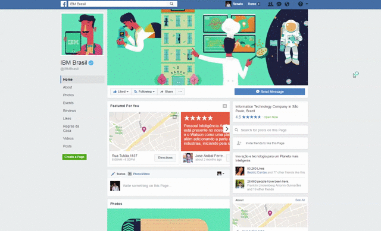
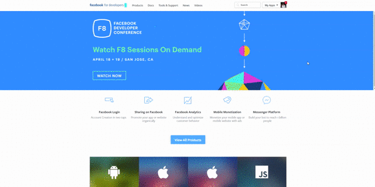
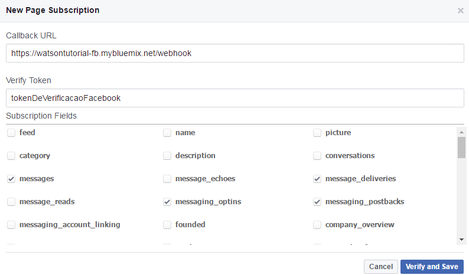

# Chat bots com Watson no Facebook

## Passo 1 - Crie uma página no Facebook
Acesse a sua timeline e crie uma página para o seu bot.

## Passo 2 - Crie um app no Facebook
1. Acesse https://developers.facebook.com/
2. Adicione a funcionalidade do Messenger ao app
3. Crie um Token associado a página criada no item 1 e guarde esse token.

## Passo 3 - Adicione suas credenciais
1. Edite o arquivo .env com as credenciais do conversation e seu token do facebook (o token gerado no passo 2.3)
2. Edite o arquivo manifest.yml (name & host) com o nome da sua aplicação no Bluemix e o caminho (único) para a sua aplicação.

## Passo 4 - Suba a sua aplicação
Utilizando o Cloud Foundry submeta a sua aplicação para o __Bluemix__. Como:

1. Instale o CF (https://github.com/cloudfoundry/cli#downloads)
2. Navegue via console (cmd) até a pasta do seu projeto
3. Digite o comando **cf login** e preencha as informações requisitadas 
4. Digite o comando **cf push** para submeter automaticamente sua aplicação

Obs: endpoint público é https://api.ng.bluemix.net

## Passo 5 - Atualize sua aplicação no facebook
Dentro do seu app do facebook edite a aplicação para adicionar webhooks nela.

1. No campo do Callback use o endereço da sua aplicação no bluemix. (Utilize __https__ e no fim da url adicione o /webhook).
2. No token de verificação utilize o token utilizado no seu .env (normalmente deixo TokenVerificacao).
3. Nos Subscription Fields você deve selecionar: messages, message_deliveries, messaging_options e messaging_postbacks.
4. Depois disso tudo aparecerá uma opção de subscrever a página “Select a page to subscribe your webhook to the page events”. Selecione a página criada no passo 1.

## Passo 6 - Registrando seu app
Agora basta você rodar o seguinte comando curl:

`curl -X POST "https://graph.facebook.com/v2.6/me/subscribed_apps?access_token=SEU_TOKEN`

Obs: se você não tem o curl instalado o link pra download é: https://curl.haxx.se/dlwiz/

__Pronto! Seu bot já está funcionando no messenger.__

